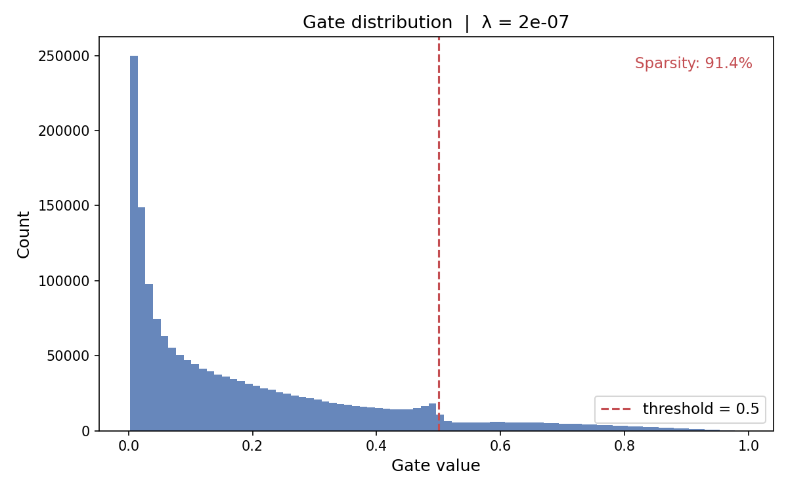

**Self-Pruning Neural Network (CIFAR-10)**

A feedforward neural network that learns to prune its own weights during training using learnable sigmoid gates and sparsity regularization.

Overview

Each weight w is paired with a learnable gate:
  g=σ(s)
The effective weight becomes:

  w′=w⋅g

To encourage pruning, the training objective is: 
  L=LCE​+λ⋅∑g

This pushes many gates toward zero, effectively removing unnecessary connections.

Key Ideas
  Self-pruning: No post-processing — pruning happens during training
  L1-style penalty on gates: Encourages sparse connectivity
  Straight-Through Estimator (STE): Enables hard gating while keeping gradients
  Warmup phase: Prevents early collapse of weights
How to Run
```bash
pip install -r requirements.txt
python train.py
```
Runs experiments for:
```bash
λ ∈ {1e-9, 1e-8, 5e-8, 2e-7}
```

Results
| Lambda | Accuracy   | Sparsity  |
| ------ | ---------- | --------- |
| 1e-9   | 52.25%     | 75.0%     |
| 1e-8   | 52.11%     | 80.9%     |
| 5e-8   | 52.27%     | 86.3%     |
| 2e-7   | **53.10%** | **91.4%** |

Sparsity = % of gates < 0.5

Observations
  Higher λ → significantly higher sparsity
  Accuracy remains stable even at >90% sparsity
  Indicates strong redundancy in the network
  Gate values naturally separate into “active” and “pruned” groups
  Design Choices
  Gate parameterization: sigmoid(gate_scores)
  Hard gating: Threshold at 0.5 with STE
  
Separate learning rates:
  weights: 1e-3
  gates: 1e-2
  Warmup (5 epochs): train without sparsity loss
  Gradient clipping: improves stability
  
Outputs

| File                            | Description               |
| ------------------------------- | ------------------------- |
| `outputs/results.csv`           | Accuracy & sparsity per λ |
| `outputs/gate_distribution.png` | Gate value histogram      |

## Results

### Gate Distribution




The model achieves ~91% sparsity with no loss in accuracy, showing that a large portion of parameters can be removed during training itself without degrading performance.
